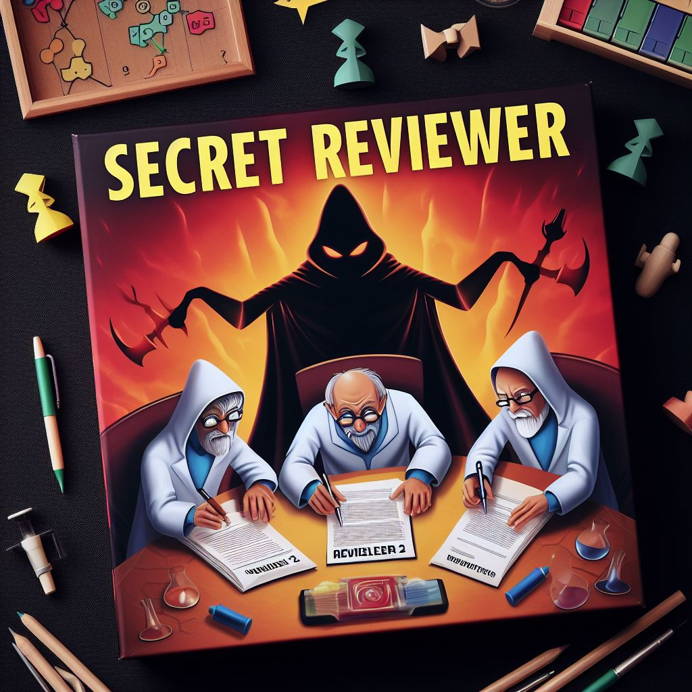

# SecretReviewer 🕵️‍♂️

 

**SecretReviewer** is a captivating board game that simulates the world of academic paper publication. Players dive into the roles of accepting reviewers, rejecting reviewers, and the infamous Reviewer 2. The mission? Navigate the treacherous waters of publishing your groundbreaking research before it's thwarted by the critics.

Download now! [Print & Play](SecretReviewer_PrintandPlay.pdf)

## 🎯 Objective

In the noble quest of academic research, scientists work tirelessly to publish their revolutionary papers. But beware! Some malevolent reviewers and the notorious "Reviewer 2" are out to reject these papers. Scientists must band together to publish their work, while adversaries conspire to halt their progress.

## 🖨 Printing the Game

To start playing SecretReviewer, you need to print out the game materials. We've prepared a file that has everything you need: the game board, cards, and instructions.

1. Download the file from our GitHub page. ([Print & Play](SecretReviewer_PrintandPlay.pdf)).
2. Print the materials on sturdy paper or cardstock for the best gaming experience.
3. Cut out the cards and prepare the game board according to the instructions.

## 🛠 Setup

1. **Publication Board:** Depending on the number of players, lay out the Publication Track on the table to chart the journey of papers towards publication or rejection.
2. **Criteria Deck:** Mix the criteria cards to create the Publication Deck, which seals the fate of the submissions.
3. **Roles Allocation:** Randomly assign roles among players. Participants can be accepting reviewers (AR), rejecting reviewers (RR), or the infamous Reviewer 2 (R2).
4. **First General Chair:** Elect the inaugural general chair to commence the game.

## 🎲 Game Play

The game unfolds through various stages, starting with the nomination of a PC chair, proceeding to a vote of confidence, and transitioning to the review phase upon approval. The General Chair (GC) assumes a critical role, wielding powers to steer the game as rejections accumulate.

### Key Phases

- **Selection:** Nomination and voting for the PC chair.
- **Review Process:** Determining the papers' destiny based on criteria cards.
- **Powers of General Chair:** Special actions accessible to the GC as the game intensifies.
- **Veto Power:** The PC chair's authority to dismiss criteria cards selected by the GC under certain conditions.

## 🏆 Winning the Game

- **Accepting Reviewers** triumph by publishing a set number of papers.
- **Rejecting Reviewers and Reviewer 2** emerge victorious by blocking sufficient publications.
- An additional victory scenario for rejecting reviewers occurs if they succeed in making "Reviewer 2" the GC after numerous rejections.

## 🔧 Customization

Want to make **SecretReviewer** your own? You can customize roles, paper titles, and criteria to fit your group's interests or to add a new twist to the game. Use the scripts provided on our GitHub page to easily adjust these elements.

### Customizing Roles

**Script for Roles:** Modify the roles in the game to introduce new characters or adjust their abilities.

[Customize Roles Script](scripts/roles/gen_roles.py)

### Customizing Paper Titles

**Script for Paper Titles:** Get creative with paper titles to add humor, relevance, or challenge to the game. This script allows you to generate or modify titles that players will work to publish or reject. This can be customized to your research group by adding Google scholar ids to the script.

[Customize Paper Titles Script](scripts/gen_papers.py)

### Customizing Criteria

**Script for Criteria:** Change the criteria cards to reflect different publishing standards or to introduce unexpected twists in the review process. This script lets you tailor the criteria to your game's theme. 
[Customize Criteria Script](scripts/gen_criteria.py)

These scripts are designed to make customization straightforward and fun. By altering roles, paper titles, and criteria, you can ensure that every game of **SecretReviewer** is a unique and engaging experience for all players.

## 🤖 Powered by ChatGPT

**SecretReviewer** is a unique board game created with the help of ChatGPT, demonstrating the innovative use of AI in game design. ChatGPT has been instrumental in generating the engaging text, vivid images, detailed role descriptions, and even the 3D models that bring the game to life.

## 🙏 Acknowledgment

This game is based on [SecretHitler](https://www.secrethitler.com/).

## 🌍 Availability

The source code is accessible on GitHub, released under the same CC BY-NC-SA 4.0 license as the original game.
